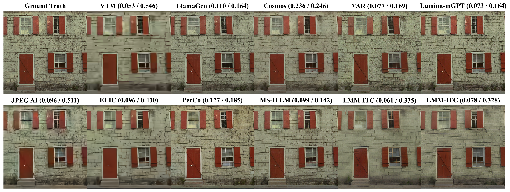
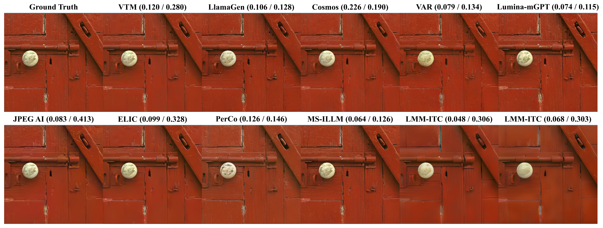
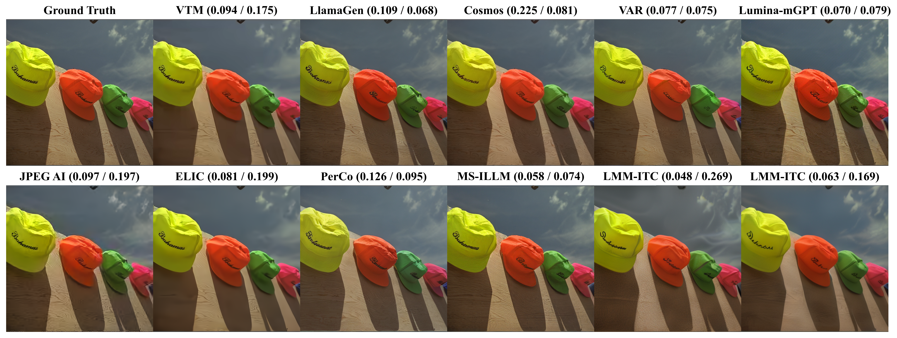
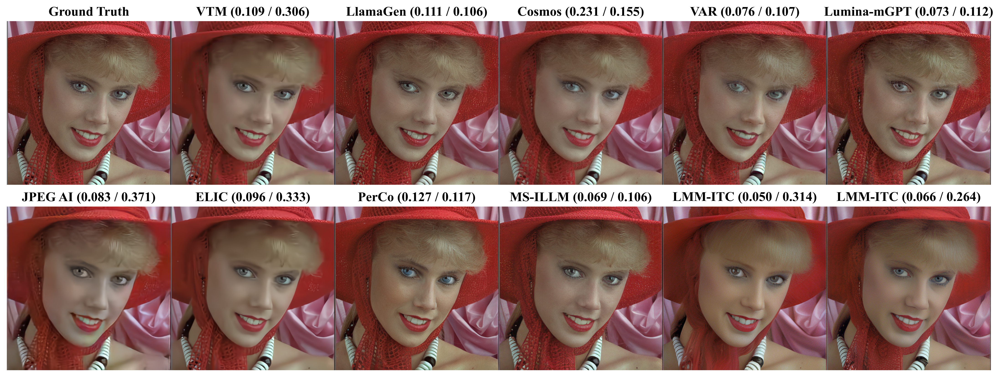

# [PCS 2025] Exploring Autoregressive Vision Foundation Models for Image Compression

Our paper has been accepted to PCS 2025. This repository contains the source code and more visualizations for our paper.

## Abstract

This work presents the first attempt to repurpose vision foundation models (VFMs) as image codecs, aiming to explore their generation capability for low-rate image compression. VFMs are widely employed in both conditional and unconditional generation scenarios across diverse downstream tasks, e.g., physical AI applications. Many VFMs employ an encoder-decoder architecture similar to that of end-to-end learned image codecs and learn an autoregressive (AR) model to perform next-token prediction. To enable compression, we repurpose the AR model in VFM for entropy coding the next token based on previously coded tokens. This approach deviates from early semantic compression efforts that rely solely on conditional generation for reconstructing input images. Extensive experiments and analysis are conducted to compare VFM-based codec to current SOTA codecs optimized for distortion or perceptual quality. Notably, certain pre-trained, general-purpose VFMs demonstrate superior perceptual quality at extremely low bitrates compared to specialized learned image codecs. This finding paves the way for a promising research direction that leverages VFMs for low-rate, semantically rich image compression.

## Visualizations





## Citation
If you find our project useful, please cite the following paper:
```
@inproceedings{VFMcodec,
    title     = {Exploring Autoregressive Vision Foundation Models for Image Compression},
  author={Huu-Tai Phung and Yu-Hsiang Lin and Yen-Kuan Ho and Wen-Hsiao Peng},

    booktitle = {Proceedings of Picture Coding Symposium (PCS)},
    year      = {2025}
}
```
